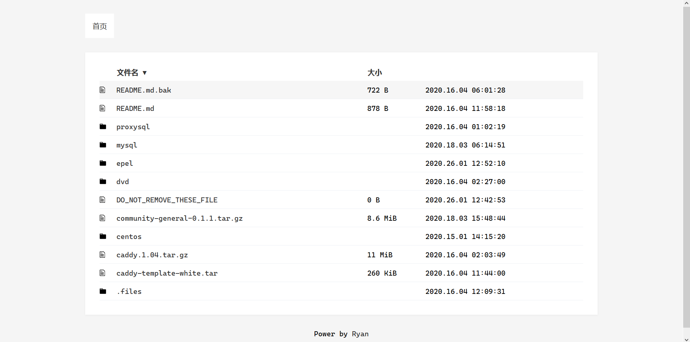
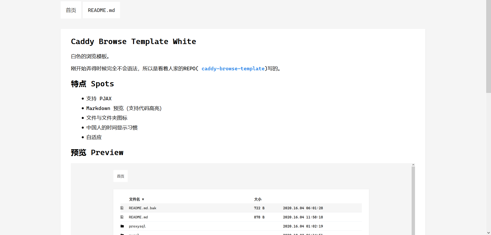

## Caddy Browse Template White

白色的浏览模板。

在更新内网yum源的时候，想写个README.md文档让使用源的人方便看，就诞生了写个Caddy浏览模板的想法，花了一点时间弄出来的。
刚开始弄得时候完全不会语法，所以是看着人家的REPO([caddy-browse-template](https://github.com/genofire/caddy-browse-template))写的。

## 特点 Spots

- 支持 PJAX
- Markdown 预览（支持代码高亮）
- 文件与文件夹图标
- 中国人的时间显示习惯
- 自适应

## 预览 Preview

### 文件列表



### Markdown 文件



## 食用方式 Usage

下载Repo中的.files目录到需要文件列表的目录中

修改Caddyfile，下面是我的Caddyfile示例

```
:80 {
    root /wwwroot
    browse / /.files/browse.tpl
    markdown / {
        ext .md
        template /.files/markdown.tpl
    }
}
```

## 感谢 Thanks

[genofire](https://github.com/genofire)

## 授权  License

[Mozilla Public License Version 2.0](LICENSE)